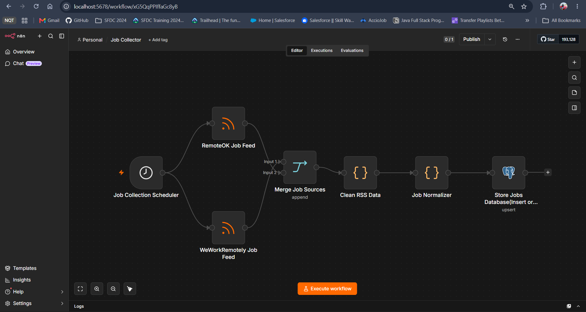
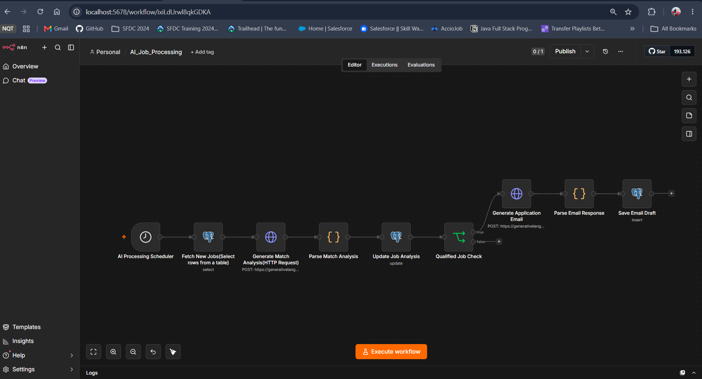
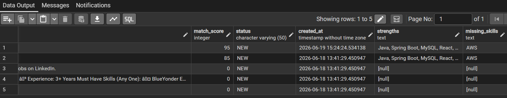
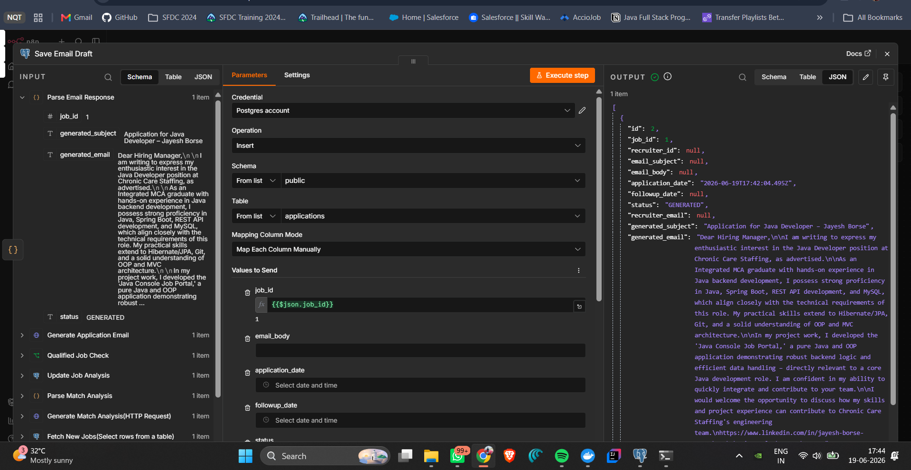

# AI-Powered Job Hunter Automation Platform

An AI-powered job search automation platform built using n8n, PostgreSQL, and Google Gemini AI.

The system automates the entire job discovery and application workflow by collecting job postings from multiple sources, analyzing candidate-job compatibility, identifying skill gaps, and generating personalized job application emails.

---

# 👥 Group Project

This project was developed as a collaborative group project.

### Primary Developer & Repository Maintainer

**Jayesh Borse**

Responsible for:

* System Architecture Design
* n8n Workflow Development
* PostgreSQL Database Design & Integration
* Google Gemini AI Integration
* Prompt Engineering
* Job Collection Pipeline Development
* AI Match Scoring Logic
* AI Email Generation Workflow
* End-to-End Testing & Debugging
* Repository Management & Documentation

### Team Contributions

Team members contributed through:

* Feature discussions and planning
* Workflow reviews and validation
* Prompt refinement and testing
* Requirement gathering
* Quality assurance and feedback
* Documentation support

The project was developed collaboratively, with implementation and system ownership managed through a centralized development environment.

---

# 🚀 Key Features

### Automated Job Collection

* Collects jobs from multiple RSS feeds
* Cleans and normalizes job data
* Prevents duplicate job entries
* Stores jobs in PostgreSQL

### AI-Powered Job Analysis

* Evaluates job descriptions against candidate profiles
* Generates match scores
* Identifies strengths
* Detects missing skills

### Personalized Email Generation

* Generates job-specific application emails
* Tailors content based on job requirements
* Creates recruiter-ready drafts automatically

### Database Tracking

* Tracks jobs and applications
* Maintains processing status
* Supports workflow automation and monitoring

---

# 🛠️ Tech Stack

| Category                | Technologies            |
| ----------------------- | ----------------------- |
| Workflow Automation     | n8n                     |
| Database                | PostgreSQL              |
| Artificial Intelligence | Google Gemini 2.5 Flash |
| Data Sources            | RSS Feeds, REST APIs    |
| Scripting               | JavaScript              |
| Data Format             | JSON                    |

---

# 📐 System Architecture

```text
RSS Sources
     ↓
Job Collector Workflow
     ↓
PostgreSQL Database
     ↓
AI Job Processing Workflow
     ↓
Match Score Analysis
     ↓
Email Generation
     ↓
Applications Database
```

---

# 🔄 Workflow Overview

## Workflow 01 – Job Collector

```text
Job Collection Scheduler
        ↓
RemoteOK Job Feed
        ↓
WeWorkRemotely Job Feed
        ↓
Merge Job Sources
        ↓
Clean RSS Data
        ↓
Job Normalizer
        ↓
Store Jobs Database
```

## Workflow 02 – AI Job Processing

```text
AI Processing Scheduler
        ↓
Fetch New Jobs
        ↓
Generate Match Analysis
        ↓
Parse Match Analysis
        ↓
Update Job Analysis
        ↓
Qualified Job Check
        ↓
Generate Application Email
        ↓
Parse Email Response
        ↓
Save Email Draft
```

---

# 📸 Project Screenshots

## Job Collector Workflow


## AI Job Processing Workflow


## PostgreSQL Database


## Generated Application Email


---

# 📊 Sample Output

## Match Analysis

```json
{
  "match_score": 85,
  "strengths": [
    "Java",
    "Spring Boot",
    "MySQL"
  ],
  "missing_skills": [
    "AWS"
  ]
}
```

## Generated Email Subject

```text
Application for Java Developer – Jayesh Borse
```

---

# 📁 Repository Structure

```text
AI-Job-Hunter-Automation/
│
├── README.md
│
├── workflows/
│   ├── 01_Job_Collector.json
│   └── 02_AI_Job_Processing.json
│
├── screenshots/
│   ├── job-collector-workflow.png
│   ├── ai-job-processing-workflow.png
│   ├── postgresql-database.png
│   └── generated-email.png
│
└── docs/
    └── architecture-diagram.png
```

---

# ⚙️ Setup Instructions

### Clone Repository

```bash
git clone https://github.com/your-username/AI-Job-Hunter-Automation.git
```

### Import Workflows

1. Open n8n
2. Import workflow JSON files
3. Configure PostgreSQL credentials
4. Configure Gemini API credentials
5. Execute workflows

---

# 🎯 Learning Outcomes

Through this project we gained hands-on experience in:

* Workflow Automation with n8n
* PostgreSQL Database Integration
* AI Integration using Gemini AI
* Prompt Engineering
* ETL Pipelines
* API Integration
* Conditional Workflow Logic
* Automation Architecture

---

# 🚀 Future Enhancements

* LinkedIn Job Integration
* Telegram Notifications
* Resume Optimization Suggestions
* Advanced Job Recommendation Engine
* Recruiter Contact Discovery
* Analytics Dashboard

---

# 👨‍💻 Contributors

* Jayesh Borse
* Priti Mali
* Himanshu Khairnar

---

# 📄 License

This project is intended for educational and portfolio purposes.
